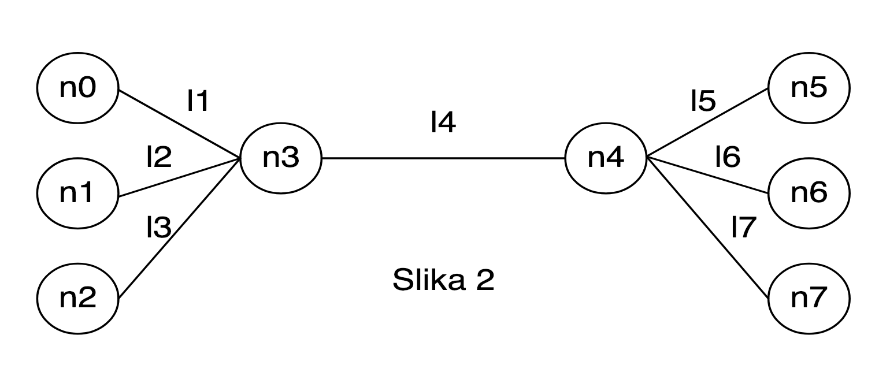

# FER - INFMRE laboratory exercise

The solutions for subgroup 5 for the laboratory exercise in
[Information Networks](https://www.fer.unizg.hr/en/course/infnet) at
[FER](https://www.fer.unizg.hr/en).

## Assignment

Our assignment is twofold. We have to implement a shortest path algorithm and
create a simulation using the
[NS2 network simulator](https://www.isi.edu/nsnam/ns/).

### Algorithm

[Original text](./algorithm_assignment_text.pdf)

Our assignment is to implement the **Bellman-Ford shortest path algorithm**.

The assignment is as follows:

1. The input for the program is a text file with the following structure
  (per line)

  ```text
  node_1, node_2, weight, direction;
  ```
  Each line represents one branch of the graph - which nodes it connects, it's
  weight and direction.

  * `node_1` and `node_2` represent the name of the node and can have a numeric
  value from 0 to infinity (unsigned 64bit integer)
  * `weight` represents the weight of the defined edge and can be `0` (meaning
  the edge has no weight) or a positive integer (unsigned 64bit integer)
  * `direction` represents other or not the edge has a direction - `u` means it
  has a direction (from notde_1 to node_2), while `n` means it doesn't have a
  direction.
2. Implement Bellman-Ford's shortest path algorithm
3. A graphical representation has to bee given for each step. The representation
  has to show the current state of the algorithm as well as clearly indicate why
  this step was taken.
4. Display the final solution
5. A report has to be written that:
  * Explains the algorithm's pseudo code
  * Documents the application that implements the algorithm
  * Has to contain an example of how the applications solves a graph with at
  least 6 nodes

### Simulation

[Original text](./simulation_assignment_text.pdf)



For the above topology setup:

1. CBR traffic flow over UDP between nodes `n0` and `n5`
  * CBR traffic model:
    - packet size: 1500 bytes
    - transmission speed: 512kb/s
    - star-end time: 1-3.5s
2. On/Off traffic flow (distributed by Paret's distribution) over a UDP
  connection between nodes `n1` and `n6`
  * On/Off traffic model:
    - packet size: 1000 bytes
    - On period: 500ms
    - Off period: 50ms
    - Transmission speed while On: 500kb/s
    - Start-end time: 2-4.5s
    - Parameter for Paret's distribution: 1
3. FTP traffic flow over TCP between nodes `n2` and `n7`
  * TCP
    - Max congestion window size: 5 packets
    - Packet size: 1500 bytes
    - Congestion control:
      + Sender agent: Vegas
      + Receiver agent: TCP Sink with one ACK per packet

Links:

* l1
  - Direction: two-sided
  - Bandwidth: 1Mb
  - Delay: 10ms
  - Queue-type: Drop Tail
* l2
  - Direction: two-sided
  - Bandwidth: 1Mb
  - Delay: 5ms
  - Queue-type: Drop Tail
* l3
  - Direction: two-sided
  - Bandwidth: 0.5Mb
  - Delay: 10ms
  - Queue-type: Drop Tail
* l4
  - Direction: two-sided
  - Bandwidth: 1.5Mb
  - Delay: 10ms
  - Queue-type: Drop Tail
* l5
  - Direction: two-sided
  - Bandwidth: 0.5Mb
  - Delay: 10ms
  - Queue-type: Drop Tail
* l6
  - Direction: two-sided
  - Bandwidth: 1Mb
  - Delay: 10ms
  - Queue-type: Drop Tail
* l7
  - Direction: two-sided
  - Bandwidth: 1Mb
  - Delay: 5ms
  - Queue-type: Drop Tail

On line (`n3`-`n4`) add a loss module that rejects packets with a 1% probability

**Simulation duration:** 5s

Collective questions:

1. Draw the flow of data over the duration of the simulation for all flows using
  `xgraph` commands and the files of your simulation.
  Example: `exec xgraph out).tr out1.tr -geometry 800x400 &`
2. Identify the moments at which throughput changes occur on the graph and
  explain them.
3. Make a screenshot from the `NAM` program and mark which are the source nodes,
  and which are the destination nodes of each flow. Also mark with which color
  the flow is drawn.

Individual questions:

1. What happens with FTP traffic throughput during and after the CBR traffic
  flow?
2. Draw the size of the TCP congestion window using `xgraph` and the files of
  your simulation. Comment the graph.
3. Vary the TCP agents and draw throughput graphs. Which TCP version has the
  maximum utilization of the available resources? Explain why.
  Supported agents:
    * Tahoe
    * Reno
    * NewReno
    * Sack1 - TCP with selective repeat (RFC2018)
    * Vegas
    * Fack - Reno with "forward acknowledgment"
